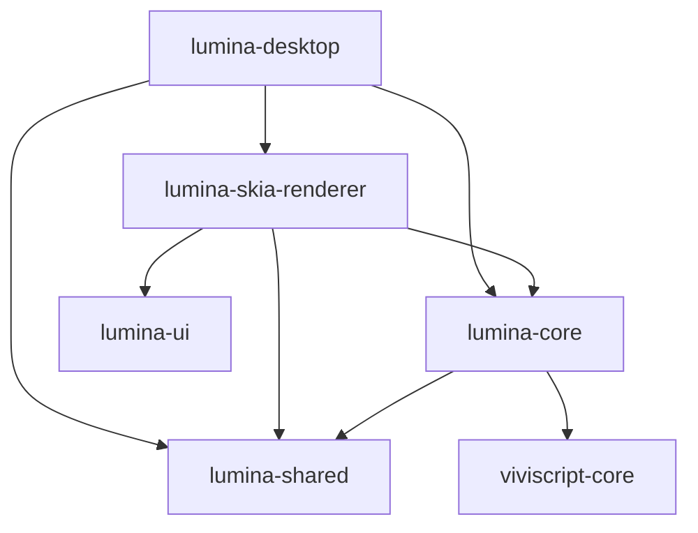

# 架构总览

LuminaTale 采用 Rust Workspace 组织代码，包含以下核心 Crate，它们构成了引擎的骨架。

## 模块依赖关系图

## 模块职责
1. `viviscript-core` (vivi编译器前端)
    - 职责：负责处理 `.vivi` 脚本源代码。
    - 输出：抽象语法树 (AST)，供 Core 执行。
    - 特点：无状态，纯函数式处理。

2. `lumina-core` (引擎内核)
    - 职责：这是引擎的“大脑”。包含虚拟机 (VM)、Lua 绑定、资源管理逻辑和存档系统。
    - 特点：不包含任何图形 API 调用，理论上可以在无头 (Headless) 环境下运行。

3. `lumina-ui` (UI 组件库)
    - 职责：定义 UI 的基础类型 (`Rect`, `Color`) 和通用控件 (`Button`, `Slider`)。
    - 特点：渲染无关 (Renderer Agnostic)，它定义了 `UiRenderer` trait，具体绘制由渲染器实现。
    - 这是 UI 布局的纯数学计算部分。

4. `lumina-skia-renderer` (UI 渲染器)
    - 职责：基于 skia-safe 和 vulkano 实现图形输出。处理窗口事件、音频播放和 UI 绘制。
    - 特点：消费 Core 产生的事件，驱动游戏循环。

5. `lumina-desktop` (启动器)
    - 职责：程序的入口点。负责读取配置、初始化日志、装载脚本并组装 Core 与 Renderer。